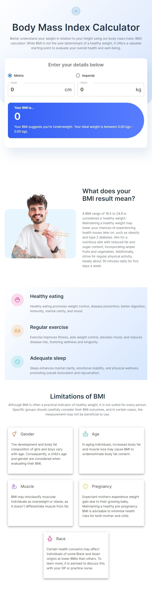
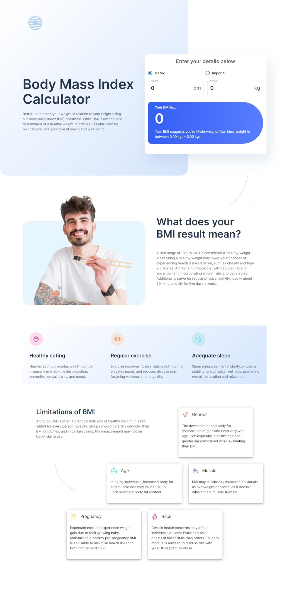

# Frontend Mentor - Body Mass Index Calculator solution

This is a solution to the [Body Mass Index Calculator challenge on Frontend Mentor](https://www.frontendmentor.io/challenges/body-mass-index-calculator-brrBkfSz1T). Frontend Mentor challenges help you improve your coding skills by building realistic projects.

## Table of contents

- [Overview](#overview)
  - [The challenge](#the-challenge)
  - [Screenshot](#screenshot)
  - [Links](#links)
- [My process](#my-process)
  - [Built with](#built-with)
  - [What I learned](#what-i-learned)
  - [Continued development](#continued-development)
  - [Useful resources](#useful-resources)
- [Author](#author)
- [Acknowledgments](#acknowledgments)

## Overview

### The challenge

Users should be able to:

- Select whether they want to use metric or imperial units
- Enter their height and weight
- See their BMI result, with their weight classification and healthy weight range
- View the optimal layout for the interface depending on their device's screen size
- See hover and focus states for all interactive elements on the page

### Screenshot






### Links

- Frontend Mentor submission page: [Bmi calculator - Frontend mentor](https://www.frontendmentor.io/solutions/bmi-calculator-uStAanTBe2)
- Live Site URL: [Bmi calculator](https://bmi-calculator-ckm.netlify.app/)

## My process

### Built with

- Semantic HTML5 markup
- CSS custom properties
- Flexbox
- Mobile-first workflow
- [React](https://reactjs.org/) - JS library
- [vite](https://vitejs.dev/) - React Frontend tooling. is a build tool that aims to provide a faster and leaner development experience for modern web projects
- [Material-ui](https://mui.com/) - Material UI is a library of React UI components that implements Google's Material Design.

### What I learned

#### Grid

The `Grid` in Material UI uses CSS's Flexible Box module for high flexibility. It consist of 12 columns which should be
represented with integer values. It will be declared as follows

```tsx
<Grid container spacing={2}>
  <Grid item xs={8}>
    <Item>xs=8</Item>
  </Grid>
  <Grid item xs={4}>
    <Item>xs=4</Item>
  </Grid>
  <Grid item xs={4}>
    <Item>xs=4</Item>
  </Grid>
  <Grid item xs={8}>
    <Item>xs=8</Item>
  </Grid>
</Grid>
```

The parent is further labelled with `container`, while the children will have the `item`

### Continued development

### Useful resources

- [Material ui - customization theming](https://mui.com/material-ui/customization/theming/) - customization and overiding default Material ui styles

## Author

- Website - [Chamu Mutezva](https://github.com/ChamuMutezva)
- Frontend Mentor - [@ChamuMutezva](https://www.frontendmentor.io/profile/ChamuMutezva)
- Twitter - [@ChamuMutezva](https://twitter.com/ChamuMutezva)

## Acknowledgments
