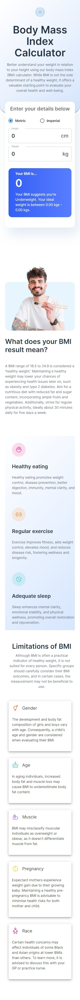

# Frontend Mentor - Body Mass Index Calculator solution

This is a solution to the [Body Mass Index Calculator challenge on Frontend Mentor](https://www.frontendmentor.io/challenges/body-mass-index-calculator-brrBkfSz1T). Frontend Mentor challenges help you improve your coding skills by building realistic projects.

## Table of contents

- [Overview](#overview)
  - [The challenge](#the-challenge)
  - [Screenshot](#screenshot)
  - [Links](#links)
- [My process](#my-process)
  - [Built with](#built-with)
  - [What I learned](#what-i-learned)
  - [Continued development](#continued-development)
  - [Useful resources](#useful-resources)
- [Author](#author)
- [Acknowledgments](#acknowledgments)

## Overview

### The challenge

Users should be able to:

- Select whether they want to use metric or imperial units
- Enter their height and weight
- See their BMI result, with their weight classification and healthy weight range
- View the optimal layout for the interface depending on their device's screen size
- See hover and focus states for all interactive elements on the page

### Screenshot




### Links

- Frontend Mentor submission page: [Bmi calculator - Frontend mentor](https://www.frontendmentor.io/solutions/bmi-calculator-uStAanTBe2)
- Live Site URL: [Bmi calculator](https://bmi-calculator-ckm.netlify.app/)
- scan the Qr code below for a live preview
  

## My process

### Built with

- Semantic HTML5 markup
- CSS custom properties
- Flexbox
- Mobile-first workflow
- [React](https://reactjs.org/) - JS library
- [vite](https://vitejs.dev/) - React Frontend tooling. is a build tool that aims to provide a faster and leaner development experience for modern web projects
- [Material-ui](https://mui.com/) - Material UI is a library of React UI components that implements Google's Material Design.

### What I learned

#### Customisation in Material-ui

Material-ui uses some built-in theme colours and font sizes. I created variables that I had intended to use to override some of the
colours and font-sizes but could not successfully do so as the values where discarded. In order to create the colour variables , I had to
do the following steps:

1. create a `theme.d.tsx` file in the `src` folder. The file has the following declarations

```tsx
import { ThemeOptions } from "@mui/material/styles";

declare module "@mui/material/styles" {
  interface Theme {
    status: {
      pureWhite: string;
      lightGrey: string;
      gunMetal: string;
      darkElectricBlue: string;
      blue: string;
    };
  }
  interface ThemeOptions {
    status: {
      pureWhite: React.CSSProperties["color"];
      lightGrey: React.CSSProperties["color"];
      gunMetal: React.CSSProperties["color"];
      darkElectricBlue: React.CSSProperties["color"];
      blue: React.CSSProperties["color"];
    };
  }
}
```

2. In the `main.tsx` file , make the following adjustments to the code

- import `createTheme` and `ThemeProvider` from Material-ui
- declare a const `theme` variable
- wrap the app with the `ThemeProvider`

```tsx
import { CssBaseline, createTheme, ThemeProvider } from "@mui/material";

import App from "./App.tsx";
import "./index.css";

const theme = createTheme({
  status: {
    pureWhite: "hsla(0, 0%, 100%, 1)",
    lightGrey: "hsla(200, 24%, 88%, 1)",
    gunMetal: "hsla(215, 31%, 21%, 1)",
    darkElectricBlue: "hsla(215, 17%, 44%, 1)",
    blue: "hsla(227, 92%, 58%, 1)",
  },
  palette: {
    // primary: {
    // light: "hsla(215, 31%, 21%, 1)",
    //  main: "hsla(0, 0,100%, 1)",
    //  },
  },
  typography: {
    fontFamily: ["Inter", "sans-serif"].join(","),
    h1: {
      fontSize: "5rem",
    },
  },
});

theme.typography.h1 = {
  fontSize: "4rem",
};

ReactDOM.createRoot(document.getElementById("root") as HTMLElement).render(
  <React.StrictMode>
    <ThemeProvider theme={theme}>
      <CssBaseline enableColorScheme />
      <App />
    </ThemeProvider>
  </React.StrictMode>
);
```

3. Finally in any file that you want to use the variables created by createTheme above , do the following:

- import `import { useTheme } from "@mui/material/styles";`
- get the colorTheme `const colorTheme = useTheme();`
- get the status object which has the colours `const { status } = colorTheme;`
- destructure the `status` variable `const { pureWhite, gunMetal, darkElectricBlue } = status;`
- Example of usage in an element `<Typography variant="body1" gutterBottom color={pureWhite}>`

#### Grid

The `Grid` in Material UI uses CSS's Flexible Box module for high flexibility. It consist of 12 columns which should be
represented with integer values. It will be declared as follows

```tsx
<Grid container spacing={2}>
  <Grid item xs={8}>
    <Item>xs=8</Item>
  </Grid>
  <Grid item xs={4}>
    <Item>xs=4</Item>
  </Grid>
  <Grid item xs={4}>
    <Item>xs=4</Item>
  </Grid>
  <Grid item xs={8}>
    <Item>xs=8</Item>
  </Grid>
</Grid>
```

The parent is further labelled with `container`, while the children will have the `item`

### Continued development

### Useful resources

- [Material ui - customization theming](https://mui.com/material-ui/customization/theming/) - customization and overiding default Material ui styles

## Author

- Website - [Chamu Mutezva](https://github.com/ChamuMutezva)
- Frontend Mentor - [@ChamuMutezva](https://www.frontendmentor.io/profile/ChamuMutezva)
- Twitter - [@ChamuMutezva](https://twitter.com/ChamuMutezva)

## Acknowledgments
